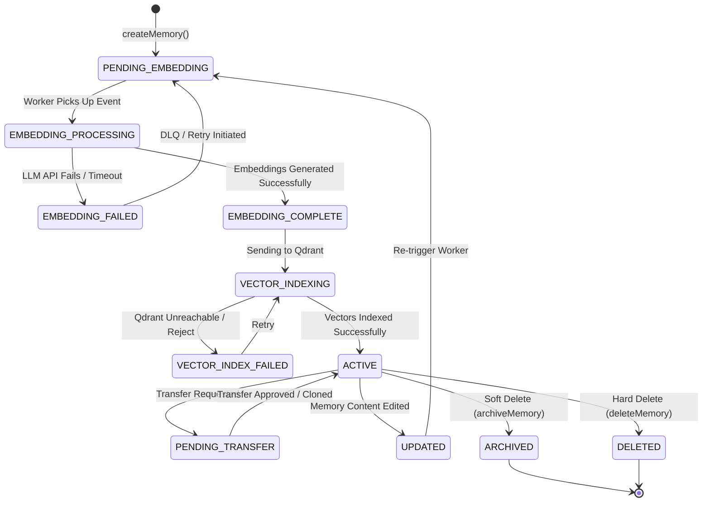

# Memory Lifecycle State Machine

## Overview
The Memory System implements an explicit state machine to strictly govern the lifecycle of a memory entry from ingestion, through LLM embedding generation, vector indexing, and eventual archival.

## State Diagram

## Failure Paths
Isolating LLM failures from Vector DB failures is critical for operational observability. 
- **`EMBEDDING_FAILED`**: Represents a failure communicating with the LLM Embedding Provider (e.g., Ollama/OpenAI). The vectors were never generated. The payload remains in Postgres.
- **`VECTOR_INDEX_FAILED`**: Represents a failure communicating with Qdrant. The embeddings *were* successfully generated (meaning we paid the token cost), but we failed to persist them to the vector database. Operations teams can inspect this state to recover the embeddings without regenerating them.

Every failure state records `last_embedding_error`, `embedding_attempts`, and `next_retry_at` in the `memory_entries` table.
